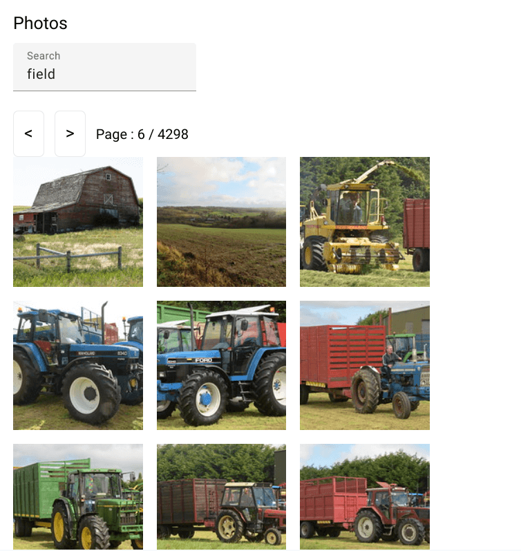
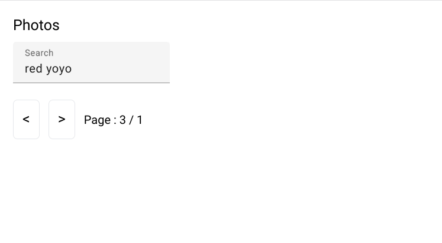

# Interop RxJs Signal

[Angular Challenges](https://angular-challenges.vercel.app/) #30 Interoperability Rxjs/Signal Alternative Solution using [NgRx Signal Store](https://ngrx.io/guide/signals/signal-store).

## Screenshots



***



***

## Built With

- [Angular](https://angular.dev)
- [Angular CLI](https://github.com/angular/angular-cli) version 17.0.7.
- [NgRx Signal Store](https://ngrx.io/guide/signals/signal-store)
- [Tailwind](https://tailwindcss.com)
- [Flickr API](https://www.flickr.com/services/developer/api/)

## Thoughts

- Since NgRx Signals Store has been officially released, I decided to try it out.  Quite frankly, it is a little overwhelming.  Since everything hinges on the `signalStore` method, you can't easily debug and piecemeal a solution.  There is limited feedback.
- I started my conversion by following the [NgRx docs](https://ngrx.io/guide/signals/rxjs-integration).
- To make further progress, I had to remove some functionality, such as the disabling of the nextPage button and the use of local storage.  I also had to remove some TypeScript restrictions.  I removed the input and gave an initial value to `search` to ensure an API request would happen. 
- The API request was executed, but I couldn't see it in the template.  With signals, sub-components seem necessary.  You can't have a form and render the response data in the same component with signals? 
- To get the input to work, I needed to add a change handler and bind that to the `Output` in `search-box.component.ts`.
- This [Angular Challenge PR](https://github.com/tomalaforge/angular-challenges/pull/88/files#diff-65b58fb82cf0bb15310b512c401850474771eb1c399793906f1d47eb7f61847c) was a critical resource in troubleshooting this app.  Looking at the PR, Marko segmented the code much better than I have done.  I kept the initial state object rather than breaking state into multiple pieces.
- Now, I can see why.  I don't think you can get access to `$update` when you add a store and a service to `withMethods`. 
- Unfortunately, the PR has outdated syntax, as the signal store API seems to have changed slightly.  Now, I think `$update` is no more.  When I tried to reuse Marko's `withStorageSync`, `$update` was underlined and not found by VS Code.  I relied on `patchState` to update the store's state.    
- For the pagination, I could update the page value, but this wouldn't trigger another API request.  If the input doesn't change, the API request will not be triggered.  
- The `loadSearch` method uses `distinctUntilChanged`.  This might prevent the `loadSearch` method from being called again as `search` has not changed.  
- Ultimately, the quickest solution was to duplicate `loadSearch`. I called the new method `newPageSearch` and called it inside the `nextPage` and `prevPage` methods.  Inside `newPageSearch`, I removed the `distinctUntilChanged` and the `debounceTime` calls.  So there is a slight benefit from using the new method, as the API request can happen as soon as the buttons are pressed.
- Marko used a `signalStoreFeature` called `withStorageSync` to handle local storage.  I tried to import it, but the signal store API seems to have changed.  There are TypeScript issues and `$update` can't be used to update state.  
- `withStorageSync` saves the whole state.  But since I have not segmented state, this doesn't work for this app.  Only the `search`, `page`, and `pages` need to be saved.  
- Saving `pages` might not be necessary.  There seem to be issues with the `pages` count and it seems to change more often than it should.  Maybe the `flickr` API is so active that the page count would change often for certain keywords.  
- So options are to try to recreate something similar or maybe just update the `onInit` hook inside `withHooks`.  You can't have multiple `onInit` hooks. 
- Ultimately, I added a similar `signalStoreFeature` called `localStorageSync`.  I used object destructuring and `patchState` to update local state with values from local storage.  
- The challenge code includes an API key for `flickr`.  Although it is already exposed, I shouldn't have included it in my repo.  So I removed it and added an environments folder with a `apiKey` variable.  Now, you can freely change API keys and not worry about including them in `git`.
- I used `git filter branch` to rewrite history and remove the file from `git`.  When I added back the service, I changed the file name to `photo.service` instead of `photos.service`.

## Continued Development

- Pagination implementation is kind of a mess.  I tried to explain a lot of the tradeoffs and problems I encountered.  
- Testing -> I'd imagine this will be difficult (lack of documentation).  
- Problem with local storage -> when you navigate to the detail page and use back arrow, the search term is lost. 
- Page number is saved -> if you search for something that has less page results, you will see nothing on the page you are on -> need logic to compare page results and local storage page value
- No disabling of next button when page count has reached max
- Typescript improvements 

## How to Use

To clone and run this application, you'll need [Git](https://git-scm.com) and [Node.js](https://nodejs.org/en/download/) (which comes with [npm](http://npmjs.com)) installed on your computer. From your command line:

```bash
# Clone this repository
$ git clone https://github.com/jdegand/interop-rxjs-signal.git

# Install dependencies
$ npm install

# Need to add / update environment.development.ts file with an apiKey from flickr

# Run the app and navigate to localhost:4200
$ npm start
```

## Useful Resources

- [transform.tools](https://transform.tools/json-to-typescript) - json to typescript
- [NgRx Docs](https://ngrx.io/guide/signals/rxjs-integration) - rxjs integration
- [Angular Training](https://www.angulartraining.com/daily-newsletter/three-ways-to-update-angular-signals/) - 3 ways to update Angular Signals
- [Github](https://github.com/ngrx/platform/discussions/3796) - (Closed) RFC: NgRx SignalStore
- [Angular Addicts](https://www.angularaddicts.com/p/from-ngrx-componentstore-to-signalstore) - ngrx component store to signal store
- [Dev.to](https://dev.to/this-is-angular/handling-pagination-with-ngrx-component-stores-1j1p#handling-the-pagination) - handling pagination with ngrx component stores